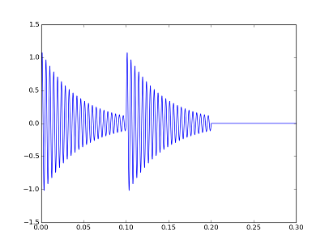

# Euclidean Rhythms

A python script to derive and play Euclidean rhythms as described in [The Distance Geometry of Music](https://arxiv.org/abs/0705.4085v1) by E. D. Demaine *et. al.* (2007). Packages [PyGame](http://www.pygame.org/docs/) and [NumPy](http://www.numpy.org/) are required. (For Raspberry Pi users, these come pre-installed on current versions of Raspbian.) Earbuds or speakers are also needed of course.

According to the reference, at least 41 rhythms from world music can be generated by a simple algorithm which resembles the [Euclidean Algorithm](https://en.wikipedia.org/wiki/Euclidean_algorithm) for finding the greatest common divisor of two natural numbers.

The 41 rhythms given in the reference are contained in a dictionary called `playlist`. To access and play the `samba` rhythm:

```
>>> from euclidean_rhythms import *
>>> playlist['conga']
[1, 1, 0]
>>> play(playlist['conga'])
```

The "conga" rhythm consists of two beats and a rest as indicated by `[1, 1, 0]`. The sound wave produced by `play` is pictured below. 



A *Euclidean rhythm* is determined by a number of beats and a total length (beats plus rests.) For instance the "conga" rhythm above has 2 beats and a total length of 3. Euclidean rhythms are precisely those generated by an algorithm shown below as `E`.

```
>>> E(2,3)
[1, 1, 0]
```

The algorithm, `E`, is know as Bjorklund's algorithm after its originator. Details can be found in the reference or the source code here.

Musical rhythms tend to be characterized by two qualitative properties termed *evenness* and *deepness*. Evenness refers to how evenly spaced the beats are. Clearly, unless the number of beats evenly divides the length of a pattern, beats cannot be precisely evenly spaced. A measure of evenness given in the reference is implemented here as function `evenness(pattern)`. Deepness concerns the distribution of pairwise distances between beats. The reference gives two definitions of deepness which are implemented here as `erdos_deep(pattern)` and `winograd_deep(pattern)`. These functions return `True` or `False` according to whether the respective deepness criteria are met.

Demaine *et. al.* show that all Euclidean rhythms are as even as possible (i.e., maximize evenness) and with a minor exception all Euclidean rhythms are Erdos deep. 
